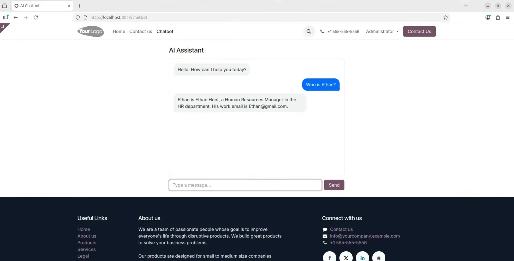

# Odoo AI Chatbot — Natural Language Interface for ERP

> Ask your ERP anything. In plain English. No training required.



A public-facing AI chatbot built as a native **Odoo 18 module**, powered by a **RocketRide AI pipeline** and **Qwen (Alibaba Cloud)** as the LLM backend. Visitors and staff can query live company data using natural language — no forms, no filters, no manual searching.

---

## Why This Exists

Enterprise ERP systems are powerful but hard to use. Most employees spend time navigating menus, applying filters, and cross-referencing data just to answer simple questions.

This project replaces that friction with a single chat interface:

> *"Who is Ethan?"* → **Ethan Hunt, HR Manager, HR Department. Work email: Ethan@gmail.com.**

No clicks. No training. Just ask.

---

## Live Demo


The chatbot is embedded directly in the Odoo website frontend. Visitors type a question, the system queries live Odoo data via an AI pipeline, and streams back a natural language answer.

---

## Architecture

```
Browser (Odoo Website)
    │
    │  GET /chatbot/stream  (Server-Sent Events)
    ▼
Odoo Controller  (main.py)
    │
    │  WebSocket  ws://localhost:5565
    ▼
RocketRide AI Pipeline  (hr_chat.pipe)
    │
    ├── Agent Node  (orchestrates tool use)
    ├── LLM Node    (Qwen-Plus via Alibaba Cloud)
    └── Tool Node   (HTTP → Odoo HR API)
                        │
                        │  GET /api/v1/employees/search
                        ▼
                   Odoo HR Module  (hr.employee)
```

### Key Design Decisions

| Decision | Rationale |
|----------|-----------|
| **RocketRide pipeline** | Visual, swappable AI workflow — change LLM or tools without touching application code |
| **Qwen-Plus (cloud LLM)** | Fast inference, strong multilingual support, OpenAI-compatible API |
| **SSE streaming** | Immediate feedback to the user — responses appear word by word |
| **Separate HR API endpoint** | Clean boundary between AI pipeline and Odoo ORM; API-key authenticated |
| **No dependency on odoo-llm** | Standalone module — only requires `website` and `hr` from Odoo core |

---

## Tech Stack

| Layer | Technology |
|-------|-----------|
| ERP Platform | Odoo 18 |
| Frontend | Odoo Website (QWeb + Vanilla JS) |
| Streaming | Server-Sent Events (SSE) |
| AI Pipeline | RocketRide Engine (Docker) |
| LLM | Qwen-Plus (Alibaba Cloud / DashScope) |
| Data Layer | Odoo ORM — `hr.employee` |
| Auth | HMAC API key (pipeline → Odoo) |

---

## Features

- **Natural language queries** — ask about employees, departments, job titles in plain text
- **Live ERP data** — answers come from your actual Odoo database, not a static knowledge base
- **Streaming responses** — word-by-word output for a responsive feel
- **Public-facing** — no Odoo login required for visitors
- **Role-based access** — visitors see public info only; logged-in staff and HR managers see work emails
- **Swappable LLM** — change from Qwen to OpenAI, Anthropic, or a local Ollama model by editing one pipeline file
- **Extensible pipeline** — add new data sources (calendar, inventory, CRM) as new tool nodes in RocketRide

---

## Project Structure

```
website_llm_chat/
├── controllers/
│   ├── main.py          # /chatbot page + /chatbot/stream SSE endpoint
│   └── hr_api.py        # /api/v1/employees/search — HR data API
├── pipelines/
│   └── hr_chat.pipe     # RocketRide pipeline definition
├── tests/
│   └── test_rbac.py     # Unit tests for RBAC pure functions
├── static/src/
│   ├── js/chatbot.js    # Frontend SSE consumer + chat UI
│   └── css/chatbot.css
├── views/
│   ├── templates.xml    # Chatbot page template
│   └── menu.xml         # Website navigation entry
├── rocketride_client.py # Async RocketRide WebSocket client
├── rbac.py              # Role → allowed fields mapping (pure, no Odoo imports)
├── __manifest__.py
└── CLAUDE.md            # Architecture notes
```

---

## Quick Start

### Prerequisites

- Odoo 18 instance
- Docker
- Qwen API key (Alibaba Cloud DashScope) — or swap for any OpenAI-compatible LLM

### 1. Start RocketRide Engine

```bash
docker run -d \
  --name rocketride-engine \
  -p 5565:5565 -p 20003:20003 \
  --env-file .env \
  ghcr.io/rocketride-org/rocketride-engine:latest
```

### 2. Configure Environment

```bash
cp .env.example .env
# Fill in:
# ROCKETRIDE_URI=ws://localhost:5565
# ROCKETRIDE_APIKEY=your_rocketride_key
# ROCKETRIDE_QWEN_API_KEY=your_qwen_key
# ROCKETRIDE_ODOO_HR_API_KEY=your_shared_secret
# ODOO_HR_API_KEY=your_shared_secret  (same value)
```

### 3. Install Odoo Module

```bash
# Add to your Odoo addons path, then:
./odoo-bin -d your_db -i website_llm_chat
```

### 4. Open the Chatbot

Navigate to `http://your-odoo/chatbot` — the chatbot is live.

---

## Extending to New Data Sources

The pipeline is modular. To add calendar or inventory queries:

1. Add a new HTTP tool node in `hr_chat.pipe` pointing to a new Odoo API endpoint
2. Create the corresponding controller in `controllers/`
3. Update the agent's system prompt to describe the new capability

No changes to core application logic required.

---

## Roadmap

- [ ] Conversation memory (multi-turn context)
- [x] Role-based access (visitor vs. staff / HR manager)
- [ ] MCP Server integration — expose Odoo tools to Claude Desktop / Cursor
- [ ] Calendar & appointment queries
- [ ] True token-level streaming from LLM

---

## Background

Built as a learning project exploring enterprise AI agent architecture on Odoo 18. The goal: design a system where natural language becomes the universal interface to ERP data — extensible, provider-agnostic, and deployable on real infrastructure.

Core concepts demonstrated:
- **AI pipeline orchestration** with RocketRide
- **Tool calling** — LLM decides when and how to query live data
- **Streaming UX** on top of a synchronous AI backend
- **ERP integration patterns** — clean API boundaries between AI and business logic

---

## License

LGPL-3.0
